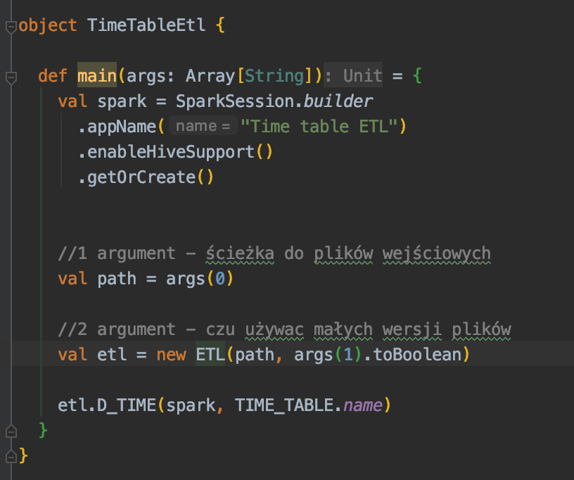
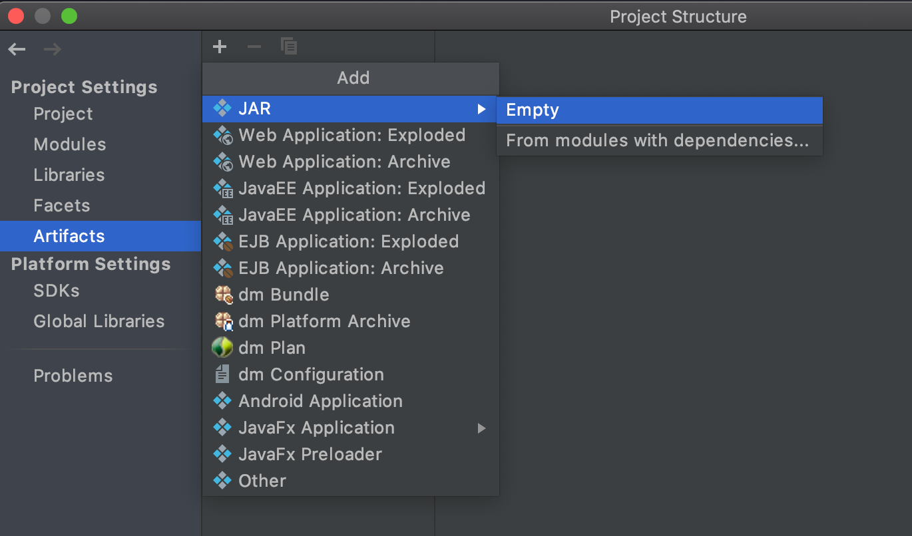
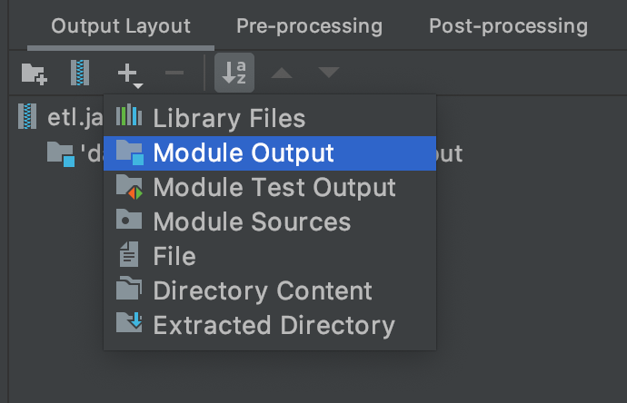
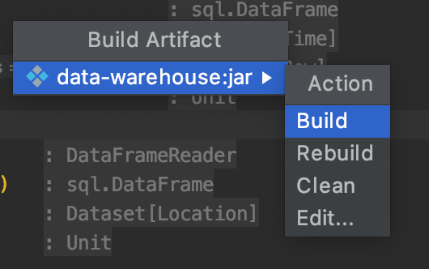

### Data warehouse

### Tworzenie jara
1. Stwórz obiekt ETLa z metodą main w pakiecie `executables`. Wykorzystaj klasę ETL. 
Ważne żeby dodać `enableHiveSupport()` i parametryzować ścieżki do plików jak w przykładzie.

1. Wybierz `File > Project Structure > Artifacts`
Kliknij `+` w lewym górnym rogu. Wybierz `JAR` a następnie 
`empty`

1. Kliknij `+` wybierz `Module Output` a następnie `data-warehouse`

1. Wybierz `Build > Build Artifacts...`. Z listy wybierz swojego jara 
i kliknij `Build`. 

1. Jar zostanie umieszczony w folderze `out/artifcats`

### Odpalanie na klastrze
1. wgraj pliki wejściowe (normalne i wersje 1000) na swój bucket do folderu `warehouse-input` na google storage
1. z shella VMki na klastrze przekopiuj pliki z bucketa na klaster 
        
        gsutil cp -r gs://<bucket-name>/warehouse-input .
1. stwórz folder na pliki wejściowe na hdfs 

        hadoop fs -mkdir -p input
1. przekopiuj pliki wejściowe z klastra na hdfs 
        
        hadoop fs -copyFromLocal warehouse-input/* input/
        
1. (opcjonalnie) przekopiuj jara na klaster 
        
        gsutil cp -r gs://<bucket-name>/etl.jar .
 
1. odpal spark-shella i włącz tryp wklejania
    
        spark-shell 
        :paste
1. wklej zawartość plików `Table.scala` oraz `SchemaCreator.scala` bez pierwszej linijki
1. stwórz schemat tabel 
        val schema = new SchemaCreator(spark)
        schema.createAll()
1. wyjdź ze spark shella `crl + d`
1. odpal etla wskazując ścieżkę do maina
        
        spark-submit --class warehouse.executables.TimeTableEtl \
        --master yarn --num-executors 5 --driver-memory 512m \
        --executor-memory 512m --executor-cores 1 etl.jar input true

Ostatnie dwa argumenty oznaczają 1) folder z plikami wejściowymi 2) czu używać małych wersji plików 
