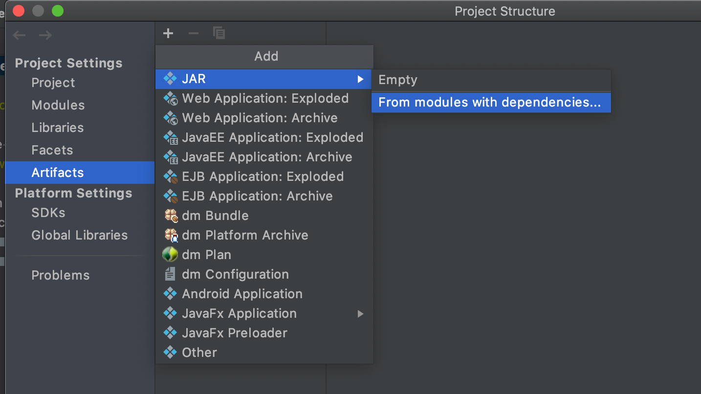
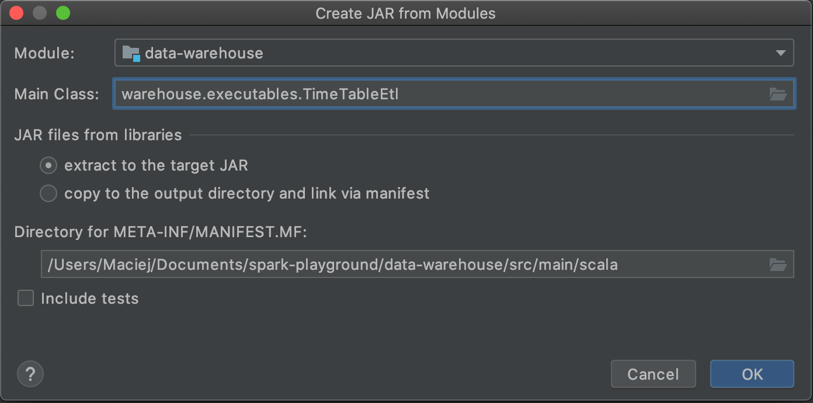

### Data warehouse

### Tworzenie jara
1. Stwórz obiekt ETLa z metodą main w pakiecie `executables`. Wykorzystaj klasę ETL.

1. Wybierz `File > Project Structure > Artifacts`
Kliknij `+` w lewym górnym rogu. Wybierz `JAR` a następnie 
`From module with dependencies...`

1. W `module` wybierz moduł `data-warehouse`. W `Main Class` wybierz 
stworzonego przez siebie ETLa.
Być może trzeba będzie zmienić folder `META/INF` jeżeli wcześniej był już 
tworzony jar.

1. Wybierz `Build > Build Artifacts...`. Z listy wybierz swojego jara 
i kliknij `Build`. 

1. Jar zostanie umieszczony w folderze `out/artifcats`